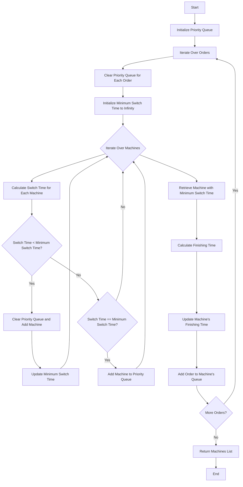

# APSDemo.java

## 1. Facts

- We can only produce one product at a time by one machine.
- We can't consider all the possible combinations of products and machines.
- Optimal solution is not guaranteed(only a good solution).

## 2. Assumptions

- Resources are not limited.
- Vialation cost is not considered yet(vialation is always allowed).

## 3. Features

- Use greedy algorithm to find the local best solution.
- Can resume the process from the last saved state(good for what-if analysis).

## 4. Input and output of the algorithms

- A sorted list of products(orders) by any criteria.
- A list of machines.
- A list of switch time between products.

## 5. Algorithm

**Optimize switch time optimized -o1**

```java
// optimize optimize_switch_time with using a priority queue to
  // store the fist free machine when having same jump time
  public static List<Machine>
  optimize_switch_time_optimize1(final List<Order> orders,
                                 final List<List<Integer>> jump_matrix,
                                 List<Machine> machines) {
    PriorityQueue<Machine> machine_queue =
        new PriorityQueue<>(new CompareMachineByFreeTime());
    for (Order o : orders) {
      machine_queue.clear();
      int machine_queue_switch_time = Integer.MAX_VALUE;
      for (Machine m : machines) {
        int switch_time = getJumpTime(jump_matrix, m.getLastOrder(), o);
        if (switch_time < machine_queue_switch_time) {
          machine_queue.clear();
          machine_queue.add(m);
          machine_queue_switch_time = switch_time;
        } else if (switch_time == machine_queue_switch_time) {
          machine_queue.add(m);
        }
      }
      // find the best machine to put the order
      Machine best_machine = machine_queue.poll();
      // calculate the finishing time
      int finishing_time = best_machine.finishing_time +
                           o.quantity / best_machine.machine_product_per_hour +
                           machine_queue_switch_time;
      // update the finishing time
      best_machine.finishing_time = finishing_time;
      // update the order queue
      best_machine.orders_in_queue.add(o);
    }
    return machines;
  }
```

 The function `optimize_switch_time_optimize1` is designed to assign orders to machines in a way that minimizes the switching time between orders, using a priority queue to efficiently find the first free machine with the same switch time. Here's a breakdown of the key procedures:

1. **Initialization of Priority Queue**:
    ```java
    PriorityQueue<Machine> machine_queue = new PriorityQueue<>(new CompareMachineByFreeTime());
    ```
    - A priority queue `machine_queue` is created, using a comparator `CompareMachineByFreeTime` that orders machines by their free time.

2. **Iterating Over Orders**:
    ```java
    for (Order o : orders) {
        machine_queue.clear();
        int machine_queue_switch_time = Integer.MAX_VALUE;
    ```
    - The function iterates through each order in the list of orders.
    - The priority queue `machine_queue` is cleared for each new order.
    - `machine_queue_switch_time` is initialized to `Integer.MAX_VALUE` to track the minimum switch time for the current order.

3. **Finding Machines with Minimum Switch Time**:
    ```java
    for (Machine m : machines) {
        int switch_time = getJumpTime(jump_matrix, m.getLastOrder(), o);
        if (switch_time < machine_queue_switch_time) {
            machine_queue.clear();
            machine_queue.add(m);
            machine_queue_switch_time = switch_time;
        } else if (switch_time == machine_queue_switch_time) {
            machine_queue.add(m);
        }
    }
    ```
    - For each machine, the switch time to the current order is calculated using the `getJumpTime` method.
    - If the calculated switch time is less than the current minimum `machine_queue_switch_time`, the priority queue is cleared and the current machine is added to the queue, and the minimum switch time is updated.
    - If the calculated switch time equals the current minimum, the machine is added to the queue without clearing it.

4. **Assigning Order to the Best Machine**:
    ```java
    Machine best_machine = machine_queue.poll();
    ```
    - The machine with the earliest free time and minimum switch time is retrieved from the priority queue.

5. **Calculating and Updating Finishing Time**:
    ```java
    int finishing_time = best_machine.finishing_time +
                         o.quantity / best_machine.machine_product_per_hour +
                         machine_queue_switch_time;
    best_machine.finishing_time = finishing_time;
    ```
    - The finishing time for the selected machine is calculated by adding the current finishing time of the machine, the time required to process the current order, and the switch time.
    - The machine's finishing time is updated with this new value.

6. **Updating Order Queue for the Machine**:
    ```java
    best_machine.orders_in_queue.add(o);
    ```
    - The current order is added to the machine's order queue.

7. **Returning the List of Machines**:
    ```java
    return machines;
    ```
    - After processing all orders, the list of machines is returned with their updated states.

In summary, the function optimizes the assignment of orders to machines by minimizing switch times using a priority queue to efficiently manage and select the best machine for each order based on their free time and switch time.


````markdown

````